# DTC Cross-Border Product Intelligence & Multi-Horizon Sourcing Radar
### 跨境电商 DTC 独立站全域多维选品情报与五维时序预测雷达 (Amazon + Temu + SHEIN + Shopify + AliExpress + TikTok + Google Trends)

[](https://opensource.org/licenses/MIT)
[]()
[]()
[]()

> **The Definitive Product Intelligence, Spy Telemetry & Seasonal Forecasting Engine for Shopify, TikTok Shop DTC, and Cross-Border E-Commerce Brands.**  
> 专为跨境电商 DTC 独立站、TikTok Shop 闭环卖家与出海品牌量身定制的**全域多维选品预测中台**。通过多平台榜单收敛与五维时序预测模型，精准发掘高转化、高毛利、低退货的超级爆品。

---

## 目录 / Table of Contents
1. [系统全景与选品方法论 / System Overview & Methodology](#1-系统全景与选品方法论--system-overview--methodology)
2. [八大平台数据收敛雷达 / 8-Platform Convergence Topology](#2-八大平台数据收敛雷达--8-platform-convergence-topology)
3. [五维时序预测矩阵 / 5-Horizon Time Forecast Matrix](#3-五维时序预测矩阵--5-horizon-time-forecast-matrix)
4. [DTC 爆品指数评分算法 / DTC Viability Index (DVI)](#4-dtc-爆品指数评分算法--dtc-viability-index-dvi)
5. [五维时序 50 大核心爆品总览 / Top 50 Winning SKUs Overview](#5-五维时序-50-大核心爆品总览--top-50-winning-skus-overview)
6. [CLI 智能选品工具指南 / Python CLI Radar Guide](#6-cli-智能选品工具指南--python-cli-radar-guide)
7. [仓库架构与快速上手 / Repository Architecture & Quickstart](#7-仓库架构与快速上手--repository-architecture--quickstart)

---

## 1. 系统全景与选品方法论 / System Overview & Methodology

在竞争激烈的跨境电商生态中，盲目在平台铺货或依赖低价内卷已被时代淘汰。真正的超级爆品诞生于**“多平台信号收敛”**与**“精准供应链时序契合”**：

```mermaid
flowchart TD
    subgraph Multi_Platforms ["1. 全域数据源收敛 / 8-Platform Signals"]
        A1["Amazon (Best Sellers / Movers & Shakers / Hot New Releases)"]
        A2["Temu (Lightning Deals / 5-Star Volume Movers)"]
        A3["SHEIN (Quick-Ship Trends / Micro-Aesthetics)"]
        A4["AliExpress (SuperDeals / Dropship Order Velocity)"]
        A5["DTC Ad Spy (PiPiADS / Minea / AdSpy / ShopHunter)"]
        A6["TikTok Shop (FastMoss / Kalodata / #TikTokMadeMeBuyIt)"]
        A7["Google Trends (Breakout Search & 5-Year Trajectory)"]
    end

    subgraph Horizon_Engine ["2. 五维时序预测 / 5-Horizon Engine"]
        H1["7 Days: 极速追热 / 闪电测品 (Dropship)"]
        H2["14 Days: 社交发酵 / 痛点爆款 (TikTok Viral)"]
        H3["30 Days: 月度主力 / 空运返单 (Monthly Mainstay)"]
        H4["60 Days: 季度节日 / 压轴海运 (Holiday Hero)"]
        H5["90 Days: 次季早鸟 / 开模研发 (Next-Season Bird)"]
    end

    subgraph DVI_Scoring ["3. DTC 爆品适配度算法 / DVI >= 80"]
        S1["3秒视觉勾子系数 (25%)"]
        S2["毛利加价倍数 >= 4.0x (25%)"]
        S3["轻小件物流自重 < 500g (15%)"]
        S4["季节与节日吻合度 (15%)"]
        S5["竞争护城河与防卷壁垒 (10%)"]
        S6["售后退货低风险 (<3%) (10%)"]
    end

    subgraph Execution ["4. 独立站高转化落地 / High-Conversion Landing"]
        E1["Shopify 落地页阶梯 Offer (Buy 2 Get 1 Free)"]
        E2["TikTok / Meta 原生 UGC 脚本 (前3秒黄金勾子)"]
        E3["中国优势产业带直采 (义乌 / 深圳 / 慈溪 / 晋江 / 澄海)"]
    end

    Multi_Platforms --> Horizon_Engine
    Horizon_Engine --> DVI_Scoring
    DVI_Scoring --> Execution
```



---

## 2. 八大平台数据收敛雷达 / 8-Platform Convergence Topology

本系统打通主流跨境 B2C 电商与知名独立站竞品监控工具：
1. **Amazon Global (美/欧/英/日)**：监控 `Movers & Shakers` 24小时飙升榜、`Hot New Releases` 新品榜及 `Most Wished For` 心愿单，验证真实市场容量与差评痛点。
2. **Temu (WhaleCo)**：监控 `Lightning Deals` 秒杀榜与 5星高频复购商品，捕捉最底层的通用刚需，反向指导独立站做**差异化包装与轻奢升级**。
3. **SHEIN**：抓取柔性快反应供应链爆品与 Y2K、Coquette、Quiet Luxury 等微观审美风向。
4. **AliExpress Choice**：监控全球一件代发采购商的早期加购趋势，提前 2–3 周捕获欧洲新兴热度。
5. **DTC 广告情报工具 (PiPiADS / Minea / AdSpy)**：追踪展现量破百万、投放超 7 天、互动率 > 5% 的海外独立站实战盈利素材。
6. **Shopify 顶尖店铺营收追踪 (ShopHunter / Dropship.io)**：洞察流水从 0 飙升到 $10,000/天的爆款单品站及其 Offer 组合。
7. **TikTok Shop (FastMoss / Kalodata)**：分析达人带货 GMV 飙升榜与短视频完播率勾子。
8. **Google Trends 搜索意图**：监控 7天/30天 Breakout 突增词与 5 年季节循环周期，杜绝非理性刷单干扰。

---

## 3. 五维时序预测矩阵 / 5-Horizon Time Forecast Matrix

根据跨境供应链物流与资金周转特点，划分 5 大时间窗口：

| 时间维度 | 适用选品打法 | 核心供应链与物流模式 | 核心选品特征 | 决策行动门槛 |
|---|---|---|---|---|
| **未来 7 天 (7D)** | 极速追热 / 闪电测款 | 空运特快专线 / 虚拟仓发货 (5–8天妥投) | 极度依赖前 3 秒视听冲击力、治愈系/恶搞冲动型 | 投放 $50/天快速测款，点击率 CTR > 3% 立即起量 |
| **未来 14 天 (14D)** | 社交裂变 / 痛点解决 | 空运专线小包 / 海外仓现货快速补单 | 显著的 Before vs After 痛点解决反差 (Problem-Solver) | TikTok 播放破百万且落地页转化率 CVR > 2.8% |
| **未来 30 天 (30D)** | 月度主力 / 垂直精铺 | 空运大包 / 海外仓 20–30 天循环返单 | 高复购、高客单价礼品套包、生活方式升级配件 | 供应链具备 1,000 件现货且 15 天内可翻单 |
| **未来 60 天 (60D)** | 季度节日 / 压轴海运 | 美西/欧线海运集装箱 (35–45天到达入仓) | 节日强关联礼品、冬季抗寒御寒、家庭聚会大件 | 提早 60 天锁仓海运，锁定黑五网一与圣诞送礼潮 |
| **未来 90 天 (90D)** | 次季早鸟 / 开模研发 | 深度 OEM/ODM 研发、供应链独家开模 | 早春户外露营、园艺修剪、春夏轻薄服饰与防晒 | 提早一个季度完成模具打样，抢占春季早鸟流量低洼 |

---

## 4. DTC 爆品指数评分算法 / DTC Viability Index (DVI)

系统依据严苛的 6 项量化加权公式，自动评估出 0–100 分的 **DVI 指数**：

$$\text{DVI} = S_{\text{visual}} \times 0.25 + S_{\text{margin}} \times 0.25 + S_{\text{logistics}} \times 0.15 + S_{\text{season}} \times 0.15 + S_{\text{competition}} \times 0.10 + S_{\text{risk}} \times 0.10$$

* **评分分级**：
  * **Tier S (Super Winner, ≥ 90分)**：全方位卓越，立即搭建单品落地页，开辟 5–10 组素材矩阵，首批锁定 1,000+ 件现货；
  * **Tier A (Strong Candidate, 80–89分)**：合格测品候选，先测 100–300 件小包一件代发；
  * **Tier B/C (< 80分)**：淘汰或需重大改版，规避物流超重、易碎或低毛利陷阱。

---

## 5. 五维时序 50 大核心爆品总览 / Top 50 Winning SKUs Overview

数据已全面结构化收录于 `data/trending-dtc-radar.json`，各时间窗口代表单品展示：

### 🚀 7-Day 极速冲量爆款 (Top 10 节选)
* **DTC-7D-01: 反重力磁吸动态流沙摆件 (DVI: 93.5)** | FOB $3.20 -> 独立站 $29.99 (9.3x) | 磁铁触碰底座瞬间黑铁砂如外星生物绽放；
* **DTC-7D-02: 微电流温热紧致下颌线美容仪 (DVI: 94.0)** | FOB $4.10 -> 独立站 $39.99 (9.7x) | 3分钟双下巴分屏即刻提拉对比；
* **DTC-7D-04: 双向静电自清洁宠物吸毛器 (DVI: 90.5)** | FOB $1.65 -> 独立站 $24.99 (15.1x) | 黑色丝绒沙发一抹即净，弹钮即清。

### ⚡ 14-Day 社交痛点爆款 (Top 10 节选)
* **DTC-14D-01: 水循环小气泡吸黑头嫩肤清洁仪 (DVI: 92.0)** | FOB $4.80 -> 独立站 $45.99 (9.5x) | 废水仓实时抽出浑浊油脂废液的极致解压视觉；
* **DTC-14D-02: 增压螺旋水流维C除氯过滤花洒 (DVI: 91.0)** | FOB $2.80 -> 独立站 $34.99 (12.5x) | 解决欧美硬水致脱发干痒痛点，对标 Jolie 订阅模式；
* **DTC-14D-05: 超薄隐形战术防盗胸前枪包 (DVI: 90.0)** | FOB $2.70 -> 独立站 $32.99 (12.2x) | 欧洲旅游防小偷神器，大衣内贴身平整隐形。

### 📦 30-Day 月度主力爆款 (Top 10 节选)
* **DTC-30D-01: 逼真火焰特效超声波香薰加湿器 (DVI: 93.0)** | FOB $3.90 -> 独立站 $39.99 (10.2x) | 关灯瞬间冷雾如温暖壁炉火焰，Q4 爆款礼品；
* **DTC-30D-02: 无痕收腹提臀紧身连体塑身衣 (DVI: 92.5)** | FOB $3.10 -> 独立站 $38.99 (12.5x) | 穿紧身裙腰围立减 3 英寸，对标 Skims 平替；
* **DTC-30D-03: 二合一磁吸数显双面暖手充电宝 (DVI: 91.0)** | FOB $4.60 -> 独立站 $39.99 (8.7x) | 磁吸一分为二放两个口袋，3秒升温至 125°F。

### ❄️ 60-Day 季度节日压轴海运爆款 (Top 10 节选)
* **DTC-60D-01: 石墨烯智能三档温控发热马甲背心 (DVI: 94.5)** | FOB $7.20 -> 独立站 $69.99 (9.7x) | 黑五网一送长辈/送老公爆品，热成像5秒升温；
* **DTC-60D-02: 光腿神器加绒加厚假透肉冬款打底裤 (DVI: 93.0)** | FOB $2.40 -> 独立站 $29.99 (12.5x) | 冰天雪地穿短裙，内衬 300g 羊羔绒但外表通透极光；
* **DTC-60D-05: 幻彩RGB蓝牙控制烟花窗帘灯串 (DVI: 92.0)** | FOB $3.80 -> 独立站 $39.99 (10.5x) | 手机音乐律动同步，客厅秒变新年烟花盛典。

### 🌱 90-Day 次季换季早鸟研发爆款 (Top 10 节选)
* **DTC-90D-01: 变频电磁波超声波驱鼠驱蚊器 (DVI: 91.0)** | FOB $1.20 -> 独立站 $24.99 (20.8x) | 开春化冻虫害爆发早鸟，整屋 6 只装客单价放大；
* **DTC-90D-02: 锂电便携高压清洗水枪 (DVI: 92.5)** | FOB $9.50 -> 独立站 $79.99 (8.4x) | 春季庭院去青苔与洗车神器，免接水管水桶自吸；
* **DTC-90D-06: 全自动速开防晒沙滩露营帐篷 (DVI: 91.5)** | FOB $6.80 -> 独立站 $59.99 (8.8x) | 往空中一扔 1 秒自动弹开成型，春假家庭刚需。

---

## 6. CLI 智能选品工具指南 / Python CLI Radar Guide

本项目内置零依赖 Python 3 命令行交互工具，支持一键筛选各维度爆品、检视广告脚本并导出研报：

```bash
# 1. 克隆项目仓库
git clone https://github.com/cnproduct/dtc-product-intelligence.git
cd dtc-product-intelligence

# 2. 输出 5 大时间维度的爆品总览概况
python3 scripts/dtc_product_radar.py --overview

# 3. 按具体时间窗口筛选 Top 10 (例如未来 7 天或未来 60 天)
python3 scripts/dtc_product_radar.py --horizon 7d
python3 scripts/dtc_product_radar.py --horizon 60d

# 4. 深度检视指定单品 (含出厂成本、利润模型、3秒视频脚本与受众定位)
python3 scripts/dtc_product_radar.py --sku DTC-7D-01

# 5. 按品类快速过滤 (Home, Beauty, Electronics, Apparel, Pet, Sports)
python3 scripts/dtc_product_radar.py --category Beauty

# 6. 一键将当前维度的选品情报导出为 Markdown 企划报告
python3 scripts/dtc_product_radar.py --export-brief --horizon 14d
```

---

# 7. 融入的开源项目与情报采集/全渠道广告/本地化工具 / Open-Source Spy, Ads & Localization Tools

本项目深度吸收了 GitHub 顶尖的开源爬虫、MCP 协议、Google Ads 套件与全球多语言本地化引擎：

```bash
# A. 窥探任意 Shopify 独立站竞品畅销榜与定价 (借鉴 lagenar/shopify-scraper)
python3 scripts/shopify_store_spy.py --url https://<competitor-shopify-domain>.com --limit 20

# B. 生成单个爆款的 Meta / TikTok / Amazon / Google Trends 跨平台反查情报矩阵 (借鉴 akvise/trends-checker)
python3 scripts/trends_breakout_tracker.py --keyword "magnesium glycinate" --geo US

# C. 生成 Google Ads 响应式搜索 (RSA 15标题/4描述) 与 PMax 素材组 (借鉴 itallstartedwithaidea/agent-skills)
python3 scripts/google_ads_builder.py --sku DTC-7D-01

# D. 生成 TikTok 30秒高转化 UGC 分镜脚本与 4 组 3 秒黄金 Hook (借鉴 tarxn/tiktok-ads-scraper)
python3 scripts/tiktok_ugc_hook_generator.py --sku DTC-7D-01

# E. 生成 ChatGPT Ads / SearchGPT 对话式搜索广告并严格校验字符合规 (借鉴 fseixas/chatgpt-ads-builder)
python3 scripts/chatgpt_ad_builder.py --sku DTC-7D-01

# F. 生成全球 5 大本土区域与多语言本地化投放套件 (Mercado Libre, Noon, Shopee, Allegro, Rakuten/Coupang)
python3 scripts/regional_market_localizer.py --sku DTC-7D-01 --region all
```

### 推荐配合使用的开源核心项目
1. **Google Ads 广告套件**: [`itallstartedwithaidea/agent-skills`](https://github.com/itallstartedwithaidea/agent-skills) (skills/google-ads) & [`itallstartedwithaidea/google-ads-skills`](https://github.com/itallstartedwithaidea/google-ads-skills) (39 ⭐) — 12项 Google Ads 技能，全自动化 RSA 标题生成与 PMax 规划；
2. **拉美电商美客多 (MELI)**: [`mercadolibre/python-sdk`](https://github.com/mercadolibre/python-sdk) (133 ⭐) — 适配墨西哥与巴西本土市场，深度整合 PIX 优惠与 Mercado Pago；
3. **东南亚电商 (Shopee)**: [`paulodarosa/shopee-scraper`](https://github.com/paulodarosa/shopee-scraper) (49 ⭐) & [`isaacgalmeida/shopee-scraper`](https://github.com/isaacgalmeida/shopee-scraper) — 虾皮畅销品价格与销量抓取；
4. **欧洲本土霸主 (Allegro)**: [`allegro/allegro-api`](https://github.com/allegro/allegro-api) (246 ⭐) — 波兰与东欧第一电商平台的 REST API 规范；
5. **TikTok Ads 广告谍报与投放**: [`tarxn/tiktok-ads-scraper`](https://github.com/tarxn/tiktok-ads-scraper) (15 ⭐) & [`amekala/ads-mcp`](https://github.com/amekala/ads-mcp) (97 ⭐) — 抓取 TikTok 在投广告寿命、互动率与受众；
6. **ChatGPT Ads 对话式广告生成**: [`fseixas/chatgpt-ads-builder`](https://github.com/fseixas/chatgpt-ads-builder) (10 ⭐) — 严格执行 OpenAI 广告规范（Headline ≤ 35 字符，Description ≤ 67 字符，Context Hints 对话触发词）；
7. **Meta Ads Library 广告生命周期**: [`RamsesAguirre777/facebook-ads-library-mcp`](https://github.com/RamsesAguirre777/facebook-ads-library-mcp) (267 ⭐) — 免官方 Token 抓取 Facebook 广告在投存活时长与素材角度；
8. **Shopify 独立站产品抓取**: [`lagenar/shopify-scraper`](https://github.com/lagenar/shopify-scraper) (178 ⭐) — 监控竞品站 `/products.json` 与断货补货动向；
9. **Google Trends 异动监控**: [`akvise/trends-checker`](https://github.com/akvise/trends-checker) (395 ⭐) & [`GeneralMills/pytrends`](https://github.com/GeneralMills/pytrends) (3726 ⭐) — 防 429 速率限制退避，提取 Breakout 飙升长尾词；
10. **Amazon 畅销与飙升榜**: [`omkarcloud/amazon-scraper`](https://github.com/omkarcloud/amazon-scraper) (241 ⭐) & [`tducret/amazon-scraper-python`](https://github.com/tducret/amazon-scraper-python) (878 ⭐) — 免代理免 Key 提取 Movers & Shakers 飙升榜。

---

## 8. 仓库架构与快速上手 / Repository Architecture & Quickstart

```text
dtc-product-intelligence/
├── README.md                                  # 双语旗舰项目白皮书与全域选品架构
├── SKILL.md                                   # Antigravity/Agent 标准选品技能规范
├── LICENSE                                    # MIT 开源许可证
├── .gitignore                                 # Git 忽略配置
├── data/
│   ├── platform-matrix.json                   # 8大平台数据源特征、榜单抓取逻辑与选品指标对照
│   ├── trending-dtc-radar.json                # 50大精选爆品库 (7d/14d/30d/60d/90d 完整结构化数据)
│   └── dtc-scoring-model.json                 # DVI 算法权重、评分门槛与硬性排查红线
├── scripts/
│   ├── dtc_product_radar.py                   # 零依赖 Python CLI 爆品雷达与研报生成工具
│   ├── shopify_store_spy.py                   # Shopify 竞品独立站畅销款与定价分析脚本
│   ├── trends_breakout_tracker.py             # Google Trends / Meta / TikTok 跨平台反查追踪器
│   ├── google_ads_builder.py                  # Google Ads 响应式搜索 (RSA) 与 PMax 广告生成脚本
│   ├── tiktok_ugc_hook_generator.py           # TikTok 30s UGC 分镜脚本与 4 组 3 秒黄金 Hook 生成器
│   ├── chatgpt_ad_builder.py                  # ChatGPT Ads / SearchGPT 对话式广告生成与字符合规校验器
│   └── regional_market_localizer.py           # 全球 5 大本土区域本土平台与多语言本地化投放套件
├── reports/
│   ├── 2026-q4-2027-q1-dtc-winning-products.md# 详尽的季度 DTC 选品白皮书 (全量数据与供应链产地)
│   └── exported-brief-7d.md                   # 导出的 7D 选品简报
└── templates/
    ├── dtc-product-brief-template.md          # 单品选品立项与盈利测算标准模板 (SOP)
    └── dtc-ad-creative-brief.md               # 独立站高转化广告脚本、3秒勾子与落地页 Offers 模版
```

---

## 贡献与商业咨询 / Contributing & Contact
* **Maintainer**: cnproduct (贸启航 / Product Radar)
* **E-Commerce Target**: Shopify, TikTok Shop DTC, WooCommerce, Amazon FBA
* **License**: MIT License
