# DTC Product Intelligence (独立站前瞻性选品智能引擎)

`dtc-product-intelligence` 是专门为跨境 DTC 独立站卖家、品牌出海团队与跨境 B2C 选品操盘手设计的下一代选品决策中台。

传统选品工具（如 Jungle Scout / Helium 10）仅反馈**已发生销售的历史滞后数据**。本 Skill 借鉴开源社区的爬虫架构与 MCP 协议，穿透 6 大数据源的**前置领先指标 (Leading Indicators)**，在竞品形成规模壁垒前捕获蓝海商机，并无缝衔接 **TikTok Ads 病毒带货素材** 与 **ChatGPT Ads 对话式搜索投放** 全链路。

```mermaid
flowchart TD
    subgraph DataSources["6大实时前置信号源 (借鉴 GitHub 开源架构)"]
        META["Meta Ad Library<br/>(facebook-ads-library-mcp)<br/>广告存活时长 ≥ 14天"]
        SHOP["Shopify Public API<br/>(shopify-scraper)<br/>/products.json & 畅销排序"]
        AMZ["Amazon Momentum<br/>(amazon-scraper)<br/>Movers & Shakers 24h飙升 ≥ 300%"]
        TRENDS["Google Trends<br/>(trends-checker / pytrends)<br/>Breakout (+5000%) 搜索异动"]
        TIKTOK["TikTok Creative Center<br/>(tiktok-scraper / ads-mcp)<br/>病毒视频播放增量 ≥ 500w"]
        ARBITRAGE["Temu / Shein / 1688<br/>(curl_cffi TLS bypass)<br/>溢价倍数 ≥ 3.5x"]
    end

    subgraph DVI["DTC Viral Index (DVI) 算法加权打分"]
        SCORE["DVI 评分模型<br/>V_search (30%) + S_ad (25%) + M_arbitrage (20%) + T_viral (15%) + C_supply (10%)"]
    end

    subgraph Horizons["5大时间维度推演"]
        H7["未来 7 天: 极速闪击款 (TikTok/Amazon 突发爆发)"]
        H14["未来 14 天: 社交裂变款 (Meta 规模放量测试期)"]
        H30["未来 30 天: 月度主力款 (Google Trends 突破拐点)"]
        H60["未来 60 天: 季度防守款 (季节前置备货/多渠道验证)"]
        H90["未来 90 天: 战略壁垒款 (私模定制/供应链深耕)"]
    end

    subgraph CreativeExecution["AI 驱动的即时投放物料生成"]
        TK_ADS["TikTok 30s UGC 脚本引擎<br/>4大3秒黄金Hook + 分镜脚本 + 话题标签"]
        GPT_ADS["ChatGPT Ads / SearchGPT 引擎<br/>35/67字符合规 + 对话意图触发库 + 缩略图Prompt"]
    end

    DataSources --> DVI
    DVI --> Horizons
    Horizons --> CreativeExecution
    CreativeExecution --> Output["输出《DTC 爆品雷达矩阵 & 跨平台投放实操指南》"]
```



---

## 借鉴与吸收的 GitHub 核心开源生态

| 平台 / 领域 | 核心开源仓库与 Stars | 吸收的技术机制与落地场景 |
| :--- | :--- | :--- |
| **Meta Ad Library** | [`RamsesAguirre777/facebook-ads-library-mcp`](https://github.com/RamsesAguirre777/facebook-ads-library-mcp) (267 ⭐)<br/>[`proxy-intell/facebook-ads-library-mcp`](https://github.com/proxy-intell/facebook-ads-library-mcp) (307 ⭐) | **MCP 原生接入 + 免 Token 抓取**：利用 headless DOM 解析广告存活天数。凡投放超过 14 天且在投素材 ≥ 5 条的广告，ROI 确定性极高。 |
| **Shopify 独立站** | [`lagenar/shopify-scraper`](https://github.com/lagenar/shopify-scraper) (178 ⭐)<br/>[`samoculus/Shopify-Scraper`](https://github.com/samoculus/Shopify-Scraper) (35 ⭐) | **公共端点穿透**：直接拉取标杆独立站 `/collections/all/products.json?sort_by=best-selling` 与 `/products.json`，秒级解析上新频率、梯队定价与断货补货动向。 |
| **Google Trends** | [`GeneralMills/pytrends`](https://github.com/GeneralMills/pytrends) (3726 ⭐)<br/>[`akvise/trends-checker`](https://github.com/akvise/trends-checker) (395 ⭐) | **防 429 退避 + Breakout 飙升提取**：提取相关查询中 "+Breakout" (+5000%) 的长尾商品词，按 7d/30d/90d 切片计算加速度。 |
| **Amazon 飙升榜** | [`omkarcloud/amazon-scraper`](https://github.com/omkarcloud/amazon-scraper) (241 ⭐)<br/>[`tducret/amazon-scraper-python`](https://github.com/tducret/amazon-scraper-python) (878 ⭐) | **Movers & Shakers 榜单穿透**：监控 24 小时内销售排名增幅超 300% 的黑马 SKU，作为 DTC 快速跟进第一信号源。 |
| **TikTok Ads 广告谍报与投放** | [`tarxn/tiktok-ads-scraper`](https://github.com/tarxn/tiktok-ads-scraper) (15 ⭐)<br/>[`amekala/ads-mcp`](https://github.com/amekala/ads-mcp) (97 ⭐)<br/>[`AdsMCP/tiktok-ads-mcp-server`](https://github.com/AdsMCP/tiktok-ads-mcp-server) (50 ⭐) | **TikTok 广告生命周期与 MCP 协议**：提取 TikTok 广告投放天数、真实用户展示量与受众画像；利用 MCP 协议实现 AI 自动化审查广告与创意诊断。 |
| **TikTok Creative Center 爆款** | [`drawrowfly/tiktok-scraper`](https://github.com/drawrowfly/tiktok-scraper) (5206 ⭐)<br/>[`lofe-w/tiktok-creative-center-scraper-public`](https://github.com/lofe-w/tiktok-creative-center-scraper-public) | **病毒视频与爆款声音/标签跟踪**：抓取 `#tiktokmademebuyit` Top 100 爆品与最高 CTR 脚本。 |
| **ChatGPT Ads / SearchGPT** | [`fseixas/chatgpt-ads-builder`](https://github.com/fseixas/chatgpt-ads-builder) (10 ⭐)<br/>[`AI-Marketing-Hub/chatgpt-ads`](https://github.com/AI-Marketing-Hub/chatgpt-ads) (7 ⭐)<br/>[`alphaparkinc/genpark-ad-copy-generator-skill`](https://github.com/alphaparkinc/genpark-ad-copy-generator-skill) (9 ⭐) | **对话式广告规范与字符合规**：OpenAI 官方广告投放规范约束（Headline ≤ 35 字符，Description ≤ 67 字符，3~5 条对话提示词 Context Hints，1024x1024 缩略图 Prompt）。 |
| **低价供货穿透** | [`littleyellowbicycle/temu-scraper`](https://github.com/littleyellowbicycle/temu-scraper)<br/>[`oxylabs/shein-scraper`](https://github.com/oxylabs/shein-scraper) (500 ⭐) | **TLS 指纹反反爬与差价套利测算**：对比 Temu/Shein/1688 裸价，确保独立站 DTC 定价具有 $\ge 3.5\times$ 溢价倍数（毛利率 $\ge 70\%$）。 |

---

## 核心算法：DTC Viral Index (DVI 爆款指数)

综合打分满分 100 分，由 5 大可量化维度决定：

$$
\text{DVI} = (V_{\text{search}} \times 0.30) + (S_{\text{ad}} \times 0.25) + (M_{\text{arbitrage}} \times 0.20) + (T_{\text{viral}} \times 0.15) + (C_{\text{supply}} \times 0.10)
$$

1. **Google Trends 搜索加速度 ($V_{\text{search}}$ - 30%)**
   - 出现 `Breakout (+5000%)` 标记：95~100 分
   - 30 天增长率 $> 150\%$：80~90 分
   - 增长率 $50\% \sim 150\%$：60~75 分
2. **Meta / TikTok 广告持续投放强度 ($S_{\text{ad}}$ - 25%)**
   - 头部竞品连续在投时长 $\ge 30$ 天且活跃素材 $\ge 10$ 条：95 分（绝对盈利印钞机）
   - 连续在投时长 $14 \sim 29$ 天：85 分
   - 新测试素材 $< 7$ 天：50~65 分
3. **利润套利与价格倍率 ($M_{\text{arbitrage}}$ - 20%)**
   - $\text{加价倍率} = \frac{\text{DTC售价}}{\text{Temu/1688供货价}}$
   - 倍率 $\ge 4.0\times$（毛利 $\ge 75\%$）：90~100 分
   - 倍率 $3.0\times \sim 3.9\times$：75~85 分
   - 倍率 $< 2.5\times$：一票否决淘汰（难以覆盖 Meta CAC 广告成本）
4. **TikTok 社交病毒裂变度 ($T_{\text{viral}}$ - 15%)**
   - 对应标签/视频播放增量超千万级，UGC 开箱互动率 $> 8\%$：90~100 分
5. **轻小件履约与供应链可控度 ($C_{\text{supply}}$ - 10%)**
   - 重量 $< 500\text{g}$，非带电非液体，无易碎结构，普货空运时效 5-7 天：95 分

---

## 5 大时间窗口选品策略与执行流

```text
未来 7 天  (极速跟卖)  -->  TikTok 热度爆发 + Amazon Movers & Shakers 前100 -> 选用国内现货一件代发 (CJ / YunExpress)
未来 14 天 (测款放量)  -->  Meta 广告验证存活超14天 -> 搭建 Shopify 落地页 + 3组对比素材 + $50/天 ABO 测款
未来 30 天 (主力打爆)  -->  Google Trends 拐点确认 -> 批量备货海外仓 (FBA/自建仓) + 开展 KOL 联盟分销
未来 60 天 (反季布局)  -->  前置抓取去年同期 60 天上升品类 -> 私模外观微创新 + 品牌化包装定制
未来 90 天 (战略壁垒)  -->  大健康/个护/智能家居等长坡厚雪品类 -> 申请海外外观专利 + FDA/CE 资质认证
```

---

## AI 驱动的跨平台广告生成规格

### 1. TikTok 30 秒高转化 UGC 脚本体系
* **4 大黄金 3 秒 Hook 心理学**：
  1. *模式中断 (Pattern Interrupt)*: "I genuinely thought this viral [Product] was a gimmick until..."
  2. *负向警告与省钱 (Negative Warning)*: "Stop scrolling! If you're still wasting money on [Pain], watch this..."
  3. *解压 ASMR (Oddly Satisfying)*: 纯微距镜头、清脆拆箱声、开合咔哒声，0 背景音乐。
  4. *亲测推荐 (TikTok Made Me Buy It)*: "Ranking random things TikTok convinced me to buy: 10/10."
* **5 段式 30s 分镜结构**：
  - `0:00 - 0:03`: 强冲击 Hook（画面高饱和对比）
  - `0:04 - 0:10`: 痛点代入与生活困扰
  - `0:11 - 0:18`: "Aha!" 产品机制演示
  - `0:19 - 0:25`: 信任背书与买家好评
  - `0:26 - 0:30`: 明确行动号召（CTA）与限时包邮政策

### 2. ChatGPT Ads / SearchGPT 对话式广告规范
* **字符合规铁律**：
  - **Headline**: $\le 35$ 个字符（超出立即驳回）
  - **Description**: $\le 67$ 个字符
* **Context Hints (对话意图触发词)**：
  - 必须采用**自然语言对话描述**（如 "User asking for the best portable blender for smoothies"），严禁堆砌无意义关键词。
* **Visual Specs**: $1024 \times 1024$ 极简产品图，专为 80~120px 缩略图优化。

---

## 本地脚本与工具链调用

Skill 目录下提供开箱即用的自动化 Python 脚本：

```bash
# 1. 运行五大周期完整雷达报表
python3 scripts/dtc_product_radar.py --horizon all

# 2. 针对指定周期（如 14天测款期）筛选 Top 5 爆款
python3 scripts/dtc_product_radar.py --horizon 14d --limit 5

# 3. 窥探任意竞争对手 Shopify 独立站热卖款与定价分布 (直接抓取公共端点)
python3 scripts/shopify_store_spy.py --url https://<competitor-shopify-store>.com --limit 20

# 4. 生成单个爆款的 Meta / TikTok / Amazon / Google Trends 跨平台反查情报矩阵
python3 scripts/trends_breakout_tracker.py --keyword "ice bath tub" --geo US

# 5. 为指定单品生成 TikTok 30s UGC 分镜脚本与 4 组 3 秒黄金 Hook
python3 scripts/tiktok_ugc_hook_generator.py --sku DTC-7D-01

# 6. 为指定单品生成 ChatGPT Ads / SearchGPT 对话式搜索合规广告（严格校验 35/67 字符）
python3 scripts/chatgpt_ad_builder.py --sku DTC-7D-01
```
