# DTC Product Intelligence (独立站前瞻性选品智能引擎)

`dtc-product-intelligence` 是专门为跨境 DTC 独立站卖家、品牌出海团队与跨境 B2C 选品操盘手设计的下一代选品决策中台。

传统选品工具（如 Jungle Scout / Helium 10）仅反馈**已发生销售的历史滞后数据**。本 Skill 借鉴开源社区的爬虫架构与 MCP 协议，穿透 6 大数据源的**前置领先指标 (Leading Indicators)**，在竞品形成规模壁垒前捕获蓝海商机；并无缝衔接 **Google Ads (RSA/PMax)**、**TikTok Ads 3秒视频分镜**、**ChatGPT Ads 对话式搜索** 与 **全球 5 大本土区域多语言本地化** 落地全链路。

```mermaid
flowchart TD
    subgraph DataSources["6大实时前置信号源 (借鉴 GitHub 开源架构)"]
        META["Meta Ad Library<br/>(facebook-ads-library-mcp)<br/>广告存活时长 ≥ 14天"]
        SHOP["Shopify Public API<br/>(shopify-scraper)<br/>/products.json & 畅销排序"]
        AMZ["Amazon Momentum<br/>(amazon-scraper)<br/>Movers & Shakers 24h飙升 ≥ 300%"]
        TRENDS["Google Trends<br/>(trends-checker / pytrends)<br/>Breakout (+5000%) 搜索异动"]
        TIKTOK["TikTok Creative Center<br/>(tiktok-scraper / ads-mcp)<br/>病毒视频播放增量 ≥ 500w"]
        ARBITRAGE["Temu / Shein / 1688<br/>(curl_cffi TLS bypass)<br/>溢价倍数 ≥ 3.5x"]
    end

    subgraph DVI["DTC Viral Index (DVI) 算法加权打分"]
        SCORE["DVI 评分模型<br/>V_search (30%) + S_ad (25%) + M_arbitrage (20%) + T_viral (15%) + C_supply (10%)"]
    end

    subgraph Horizons["5大时间维度推演"]
        H7["未来 7 天: 极速闪击款 (TikTok/Amazon 突发爆发)"]
        H14["未来 14 天: 社交裂变款 (Meta 规模放量测试期)"]
        H30["未来 30 天: 月度主力款 (Google Trends 突破拐点)"]
        H60["未来 60 天: 季度防守款 (季节前置备货/多渠道验证)"]
        H90["未来 90 天: 战略壁垒款 (私模定制/供应链深耕)"]
    end

    subgraph CreativeExecution["全域高转化广告与本土化落地生成"]
        G_ADS["Google Ads 引擎 (google_ads_builder.py)<br/>15组RSA标题(≤30字) + 4组描述(≤90字) + PMax素材 + 关键词意图/否定词"]
        TK_ADS["TikTok 30s UGC 脚本引擎 (tiktok_ugc_hook_generator.py)<br/>4大3秒黄金Hook + 5段式分镜 + 话题标签"]
        GPT_ADS["ChatGPT Ads 引擎 (chatgpt_ad_builder.py)<br/>35/67字符合规 + 对话意图触发词库 (Context Hints)"]
        REGIONAL["多语言本土平台适配引擎 (regional_market_localizer.py)<br/>拉美(Mercado Libre/PIX) + 中东(Noon/Snapchat/COD) + 东南亚(Shopee) + 欧洲(Allegro) + 日韩(Rakuten/Coupang)"]
    end

    DataSources --> DVI
    DVI --> Horizons
    Horizons --> CreativeExecution
    CreativeExecution --> Output["输出《DTC 爆品雷达矩阵 & 全球全渠道投放实施指南》"]
```



---

## 借鉴与吸收的 GitHub 核心开源生态

| 平台 / 领域 | 核心开源仓库与 Stars | 吸收的技术机制与落地场景 |
| :--- | :--- | :--- |
| **Google Ads 广告套件** | [`itallstartedwithaidea/agent-skills`](https://github.com/itallstartedwithaidea/agent-skills) (skills/google-ads)<br/>[`itallstartedwithaidea/google-ads-skills`](https://github.com/itallstartedwithaidea/google-ads-skills) (39 ⭐) | **12 项 Google Ads Agent 技能体系**：RSA 响应式搜索广告生成、PMax 资产组规划、否定词剔除、关键词精准匹配（Exact/Phrase/Broad）与 PPC 竞价数学模型。 |
| **全渠道广告 MCP** | [`amekala/ads-mcp`](https://github.com/amekala/ads-mcp) (97 ⭐)<br/>[`markifact/markifact-mcp`](https://github.com/markifact/markifact-mcp) (49 ⭐) | **Google/Meta/TikTok 跨渠道 MCP 协议**：支持直接连接广告 API，执行广告活动审查、素材疲劳诊断与实时投放指标分析。 |
| **拉美市场 (Mercado Libre)** | [`mercadolibre/python-sdk`](https://github.com/mercadolibre/python-sdk) (133 ⭐)<br/>[`mercadolibre/php-sdk`](https://github.com/mercadolibre/php-sdk) (191 ⭐) | **美客多 (MELI) 本地化规则**：适配墨西哥西语 (ES-MX) 与巴西葡语 (PT-BR)，深度挂载 **PIX 即时支付**（额外5%折扣）、**Mercado Pago 12期免息** 与 **Envío FULL 次日达** 徽标。 |
| **中东与海湾六国 (Noon/Snap)** | 本土电商标杆与 Snapchat Ads 特性 | **中东本土化成交核心**：针对沙特、阿联酋适配阿拉伯语 (AR - 从右至左排版)，突出 **COD 货到付款 (الدفع عند الاستلام)**、**Tabby / Tamara 4期免息先买后付 (تابي وتمارا)**，优先配置中东第一大渠道 **Snapchat 垂直全屏广告**。 |
| **东南亚市场 (Shopee/Lazada)** | [`paulodarosa/shopee-scraper`](https://github.com/paulodarosa/shopee-scraper) (49 ⭐)<br/>[`isaacgalmeida/shopee-scraper`](https://github.com/isaacgalmeida/shopee-scraper) (5 ⭐) | **虾皮/Lazada 流量捕获**：适配印尼语 (ID)、泰语 (TH)、越南语 (VI)，突出 **Gratis Ongkir Xtra 免运费券**、**Bayar di Tempat (COD)** 与抗热带高温潮湿特性。 |
| **欧洲本土垄断平台 (Allegro/Otto)**| [`allegro/allegro-api`](https://github.com/allegro/allegro-api) (246 ⭐) | **波兰与德法本土霸主穿透**：波兰 Allegro 必须挂载 **Allegro Smart!** 免运；德国 Otto/Kaufland 严守 **TÜV/CE/GS 安全认证** 与 **Kauf auf Rechnung (账单后付)**；法国强制遵守 **Triman 垃圾分类标与维修评分**。 |
| **日韩本土平台 (Rakuten/Coupang)**| 日本乐天与韩国 Coupang 架构 | **极致精致与火箭配送**：日本乐天突出 **楽天ポイント (Rakuten Points) 5倍积分** 与极度严谨敬语；韩国 Coupang 突出 **로켓배송 (Rocket Delivery) 晨间送达**。 |
| **俄罗斯与独联体 (Ozon/WB)**| [`pythontoday/ozon_scraper`](https://github.com/pythontoday/ozon_scraper) (41 ⭐)<br/>[`aknikolaeva/Wildberries-Scraper`](https://github.com/aknikolaeva/Wildberries-Scraper) | **俄语区双雄选品与广告本地化**：针对 Ozon 与 Wildberries 适配俄语原生文案、卢布 (RUB) 梯队定价、Ozon 卡 5-10% 优惠、SBP 极速支付、ПВЗ 自提点履约与耐低温 (-30°C) 卖点；店铺级批量搬家与上架由专用 `ozon-to-wb-fast-listing` 工具协同承接。 |
| **Meta Ad Library** | [`RamsesAguirre777/facebook-ads-library-mcp`](https://github.com/RamsesAguirre777/facebook-ads-library-mcp) (267 ⭐) | **MCP 原生免 Token 抓取**：利用 headless DOM 解析广告存活天数。凡投放超过 14 天且在投素材 ≥ 5 条的广告，ROI 确定性极高。 |
| **Shopify 独立站** | [`lagenar/shopify-scraper`](https://github.com/lagenar/shopify-scraper) (178 ⭐) | **公共端点穿透**：直接拉取标杆站 `/collections/all/products.json?sort_by=best-selling`，秒级解析上新频率与热销排行。 |
| **TikTok Ads 广告与趋势** | [`tarxn/tiktok-ads-scraper`](https://github.com/tarxn/tiktok-ads-scraper) (15 ⭐)<br/>[`drawrowfly/tiktok-scraper`](https://github.com/drawrowfly/tiktok-scraper) (5206 ⭐) | **广告寿命监控与视频爆款**：提取广告投放天数与 `#tiktokmademebuyit` 飙升视频。 |
| **ChatGPT Ads / SearchGPT** | [`fseixas/chatgpt-ads-builder`](https://github.com/fseixas/chatgpt-ads-builder) (10 ⭐) | **OpenAI 官方规范**：Headline ≤ 35 字符，Description ≤ 67 字符，Context Hints 对话触发词库。 |

---

## 核心算法：DTC Viral Index (DVI 爆款指数)

综合打分满分 100 分，由 5 大可量化维度决定：

$$
\text{DVI} = (V_{\text{search}} \times 0.30) + (S_{\text{ad}} \times 0.25) + (M_{\text{arbitrage}} \times 0.20) + (T_{\text{viral}} \times 0.15) + (C_{\text{supply}} \times 0.10)
$$

1. **Google Trends 搜索加速度 ($V_{\text{search}}$ - 30%)**
   - 出现 `Breakout (+5000%)` 标记：95~100 分
   - 30 天增长率 $> 150\%$：80~90 分
   - 增长率 $50\% \sim 150\%$：60~75 分
2. **Meta / TikTok 广告持续投放强度 ($S_{\text{ad}}$ - 25%)**
   - 头部竞品连续在投时长 $\ge 30$ 天且活跃素材 $\ge 10$ 条：95 分（绝对盈利印钞机）
   - 连续在投时长 $14 \sim 29$ 天：85 分
   - 新测试素材 $< 7$ 天：50~65 分
3. **利润套利与价格倍率 ($M_{\text{arbitrage}}$ - 20%)**
   - $\text{加价倍率} = \frac{\text{DTC售价}}{\text{Temu/1688供货价}}$
   - 倍率 $\ge 4.0\times$（毛利 $\ge 75\%$）：90~100 分
   - 倍率 $3.0\times \sim 3.9\times$：75~85 分
   - 倍率 $< 2.5\times$：一票否决淘汰（难以覆盖 CAC 广告成本）
4. **TikTok 社交病毒裂变度 ($T_{\text{viral}}$ - 15%)**
   - 对应标签/视频播放增量超千万级，UGC 开箱互动率 $> 8\%$：90~100 分
5. **轻小件履约与供应链可控度 ($C_{\text{supply}}$ - 10%)**
   - 重量 $< 500\text{g}$，非带电非液体，无易碎结构，普货空运时效 5-7 天：95 分

---

## 全域跨渠道广告生成规格

### 1. Google Ads (RSA & PMax) 官方合规规范
- **15 组 RSA 标题**: 每组严格 $\le 30$ 字符（品牌、效果、折扣、信任背书、CTA 梯队组合）。
- **4 组 RSA 描述**: 每组严格 $\le 90$ 字符。
- **PMax 资产组**: Long Headline $\le 90$ 字符，Business Name $\le 25$ 字符。
- **关键词匹配意图**: 精确匹配 `[kw]`、词组匹配 `"kw"`、广泛匹配 `kw` 与 12 组核心否定词库（Negative Keywords，杜绝浪费预算）。

### 2. TikTok 30 秒高转化 UGC 脚本体系
- **4 大黄金 3 秒 Hook**: 质疑模式中断 / 负向省钱警告 / 解压 ASMR 微距 / 亲测 10/10。
- **5 段式 30s 分镜表**: Hook(0-3s) $\to$ 痛点代入(4-10s) $\to$ 产品机制演示(11-18s) $\to$ 信任见证(19-25s) $\to$ 紧迫感行动号召(26-30s)。

### 3. ChatGPT Ads / SearchGPT 对话式广告规范
- **字符限制**: Headline $\le 35$ 字符，Description $\le 67$ 字符。
- **Context Hints**: 采用自然对话提问语义作为触发探针（例如 "User asking for the best..."）。

### 4. 全球 5 大本土区域转化要素
- **拉美**: 西班牙语/巴西葡语；PIX 5% 额外立减，Mercado Pago 12期分期，Envío FULL 次日达。
- **中东**: 阿拉伯语 RTL 排版；COD 货到付款，Tabby/Tamara 4期免息，Snapchat 全屏广告。
- **东南亚**: 印尼语/泰语/越南语；Gratis Ongkir 免运券，COD，双位数大促狂欢节。
- **欧洲本土**: 波兰语/德语/法语；Allegro Smart! 柜取，TÜV/CE 认证，Kauf auf Rechnung。
- **日韩**: 日语/韩语；乐天 Super Points 5倍，Coupang Rocket 晨间配送，微米级品质保证。
- **俄罗斯与独联体**: 俄语 (RU)；Ozon 卡 5-10% 立减，SBP 极速支付，近邻自提点 (ПВЗ) 取件，耐低温防冻特性 (-30°C / -40°C)，EAC 认证与俄罗斯诚实标签。针对店铺商品搬家与批量上架可协同调用专用 `ozon-to-wb-fast-listing` 工具。

---

## 本地脚本与工具链调用

Skill 目录下提供开箱即用的自动化 Python 脚本：

```bash
# 1. 运行五大周期完整爆品雷达报表
python3 scripts/dtc_product_radar.py --horizon all

# 2. 窥探任意竞争对手 Shopify 独立站热卖款与定价分布
python3 scripts/shopify_store_spy.py --url https://<competitor-shopify-store>.com --limit 20

# 3. 生成单个爆款的跨平台反查情报矩阵 (Google Trends / Meta / TikTok / Amazon)
python3 scripts/trends_breakout_tracker.py --keyword "ice bath tub" --geo US

# 4. 生成 Google Ads 响应式搜索 (RSA 15标题/4描述) 与 PMax 广告投放物料
python3 scripts/google_ads_builder.py --sku DTC-7D-01

# 5. 生成 TikTok 30s UGC 分镜脚本与 4 组 3 秒黄金 Hook
python3 scripts/tiktok_ugc_hook_generator.py --sku DTC-7D-01

# 6. 生成 ChatGPT Ads / SearchGPT 对话式合规广告（严格校验 35/67 字符）
python3 scripts/chatgpt_ad_builder.py --sku DTC-7D-01

# 7. 生成全球 5 大本土平台与多语言本地化投放套件 (Mercado Libre, Noon, Shopee, Allegro, Rakuten)
python3 scripts/regional_market_localizer.py --sku DTC-7D-01 --region all
```
